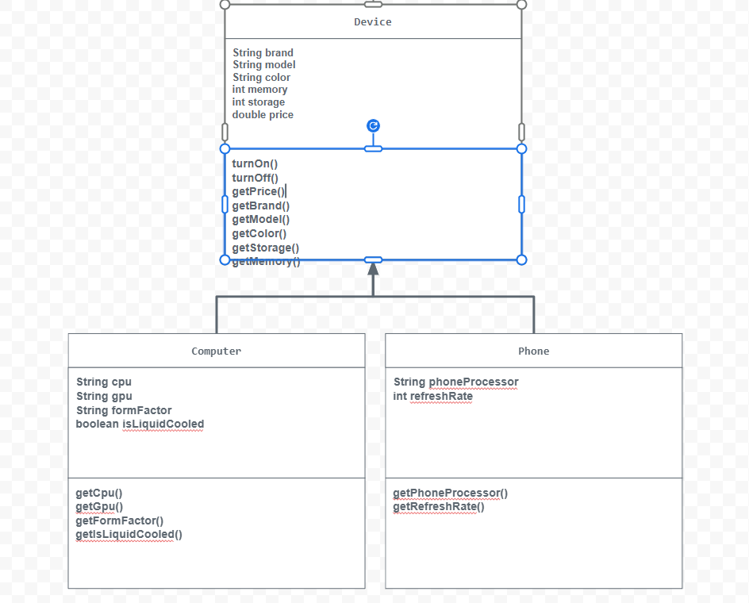

# Unit 2 - Store Management Project

## Introduction

You are opening a new business in your community! Businesses often need programs to manage the products and services they offer and track orders and requests from customers. Your goal is to create a store management system for your business.

## Requirements

Use your knowledge of object-oriented programming and class structure and design to create your store management system:
- **Create a class hierarchy** – Develop a superclass that represents a product or service your business offers and one or more subclasses that extend the superclass to represent more specific types of products or services.
- **Declare instance variables** – Declare instance variables in the superclass that are shared with the subclasses and instance variables in the subclasses that are not shared with the superclass.
- **Write constructors** – Write no-argument and parameterized constructors in the superclass and subclasses. Subclass constructors use the super keyword to call the superclass constructor.
- **Implement accessor and mutator methods** – Write accessor and mutator methods for instance variables that should be accessible and/or modifiable from outside of the class.
- **Implement a toString() method** – Write toString() methods in the superclass and subclasses that return information about the state of an object.

## UML Diagram

## Description

For my project, I created an electronics store. I chose this topic because I wanted to see how object-oriented programming concepts can represent real world items like computers and phones. I created a superclass called Device that stores properties of electronic devices, including brand, model, color, memory, storage, and price. Then, I created the subclasses Computer and Phone that extend Device and include more attributes specific to each type of device. For example, Computer has CPU, GPU, form factor, and isLiquidCooled, while Phone has phoneProcessor and refreshRate. I used constructors to create devices with either default or specific values and getter methods to access the properties of each object. Using toString(), I combined information from both the superclass and subclass so that each device can show all its details when printed to the console. This shows how a store might display products to a customer.
